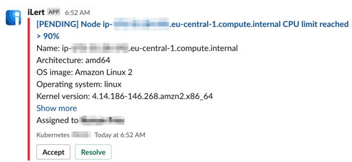
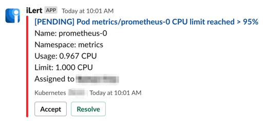

# ilert-kube-agent

[](https://github.com/iLert/ilert-kube-agent/actions)
[](https://goreportcard.com/report/github.com/iLert/ilert-kube-agent) [](https://godoc.org/github.com/iLert/ilert-kube-agent)
[](https://hub.docker.com/r/ilert/ilert-kube-agent)

ilert-kube-agent is a service that listens to the Kubernetes API
server and generates incidents about the health state of the pods and the nodes.

<sub>Node alert example:</sup>


<sub>Pod alert example:</sup>


## Usage

Simply build and run ilert-kube-agent to get Kubernetes cluster alarms.
| Flag | Description |
| ----------------------------------------- | -------------------------------------------------------------------------------------------------------------------------------------------------------------------------------------------------------------------- |
| `--alarms.cluster.enabled` | Enables cluster alarms. Triggers an alarm if any cluster problem occurred e.g. API server not available [Default: true] |
| `--alarms.pods.terminate.enabled` | Enables terminate pod alarms. Triggers an alarm if any pod terminated e.g. Terminated, OOMKilled, Error, ContainerCannotRun, DeadlineExceeded, Evicted [Default: true] |
| `--alarms.pods.waiting.enabled` | Enables waiting pod alarms. Triggers an alarm if any pod in waiting status e.g. CrashLoopBackOff, ErrImagePull, ImagePullBackOff, CreateContainerConfigError, InvalidImageName, CreateContainerError [Default: true] |
| `--alarms.pods.restarts.enabled` | Enables restarts pod alarms. Triggers an alarm if any pod restarts count reached threshold [Default: true] |
| `--alarms.pods.resources.cpu.enabled` | Enables pod CPU resource alarms. Triggers an alarm if any pod reaches CPU limit [Default: true] |
| `--alarms.pods.resources.memory.enabled` | Enables pod CPU resource alarms. Triggers an alarm if any pod reaches memory limit [Default: true] |
| `--alarms.nodes.terminate.enabled` | Enables terminate node alarms. Triggers an alarm if any node terminated. [Default: true] |
| `--alarms.nodes.resources.cpu.enabled` | Enables node CPU resource alarms. Triggers an alarm if any node reaches CPU limit [Default: true] |
| `--alarms.nodes.resources.memory.enabled` | Enables node CPU resource alarms. Triggers an alarm if any node reaches memory limit [Default: true] |

## Deployment

**Note:** Google Kubernetes Engine (GKE) Users - GKE has strict role permissions that will prevent the kube-state-metrics roles and role bindings from being created. To work around this, you can give your GCP identity the cluster-admin role by running the following one-liner:

```sh
kubectl create clusterrolebinding cluster-admin-binding --clusterrole=cluster-admin --user=$(gcloud info --format='value(config.account)')
```

### Helm Deployment (recommended)

```sh
helm repo add ilert https://ilert.github.io/charts/
helm repo update

helm upgrade --install --namespace kube-systems \
    ilert-kube-agent ilert/ilert-kube-agent \
    --set config.settings.apiKey="<YOUR KEY HERE>"
```

### Terraform Deployment (recommended)

- Define module:

```hcl
module "ilert-kube-agent" {
  source  = "iLert/ilert-kube-agent/kubernetes"
  replicas = 2
  api_key = "<YOUR KEY HERE>"
}
```

- Apply changes

```sh
terraform init
terraform apply
```

### Lambda Deployment

Follow [this guide](deployment/lambda/README.md) please.

### Raw YAML Deployment

To deploy this project, you can simply run `kubectl apply -f deployment/standard` and a
Kubernetes service and deployment will be created.

## Getting help

We are happy to respond to [GitHub issues][issues] as well.

[issues]: https://github.com/iLert/ilert-kube-agent/issues/new

<br>

#### License

<sup>
Licensed under <a href="LICENSE">Apache License, Version
2.0</a>
</sup>

<br>

<sub>
Unless you explicitly state otherwise, any contribution intentionally submitted for inclusion in ilert-kube-agent by you, as defined in the Apache-2.0 license, shall be dual licensed as above, without any additional terms or conditions.
</sub>
